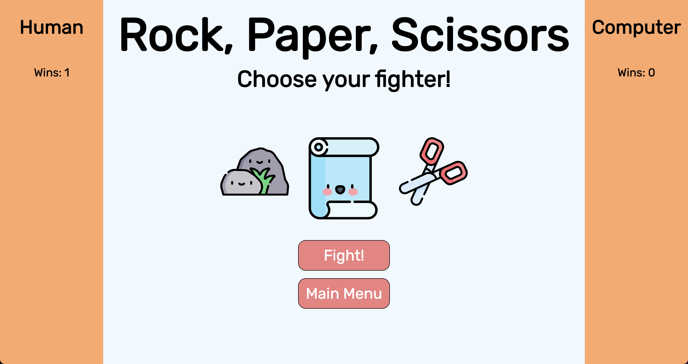

### Abstract:
[//]: <> (Briefly describe what you built and its features. What problem is the app solving? How does this application solve that problem?)
This project builds a rock/paper/scissors game in a browser. It allows users to play round of rock/paper/scissors, track their score across multiple round, and switch gametypes to a more complex game version while keeping track of their score.

### Installation Instructions:
[//]: <> (What steps does a person have to take to get your app cloned down and running?)
1. Fork GitHub repository
1. Clone repository to local machine using SSH code
1. Open terminal
1. Type "git clone <SSH code>"
1. Navigate into the project directory
1. Type "open index.html" to open the game in your browser

### Preview of App:
[//]: <> (Provide ONE gif or screenshot of your application - choose the "coolest" piece of functionality to show off.)

### Context:
[//]: <> (Give some context for the project here. How long did you have to work on it? How far into the Turing program are you?)
This application took me about 25 hours to make. I spent a considerable amount of time developing a "custom" game mode that didn't make the final cut. In retrospect, I should have saved the custom mode until the game was 100% complete and polished. I'm currently about six weeks into the curriculum at Turing, so this was a good way for me to practice some OOP fundamentals.

### Contributors:
[//]: <> (Who worked on this application? Link to their GitHubs
https://github.com/jwasmer sole contributor

### Learning Goals:
[//]: <> (What were the learning goals of this project? What tech did you work with?)
1. Organize and execute a project from start to finish
1. Practice DOM manipulation
1. Ensure data model remains source of truth

### Wins + Challenges:
[//]: <> (What are 2-3 wins you have from this project? What were some challenges you faced - and how did you get over them?)
1. I'm very happy with my dynamic game logic. My code determines a winner without hard-coding in the solutions. I intended to leverage this to make a custom game mode, but I didn't end up having time to build that feature out.
1. It was fun to play around with some of the CSS transitions to smooth out the UI interactions.
1. A huge challenge was anticipating how much more time a custom mode would take compared to a standard mode. Lesson learned: ensure core functionality is complete before budgeting time for extra features.
